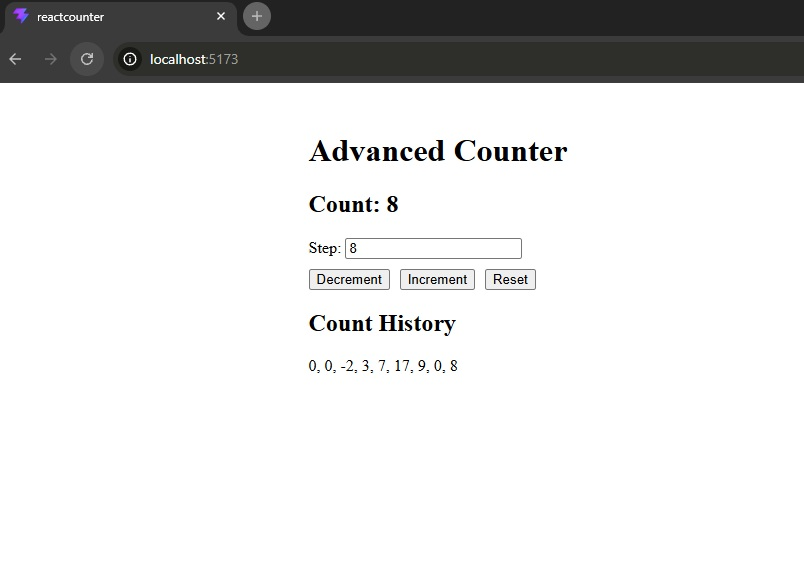

# React + TypeScript + Vite

This project is an **Advanced Counter application built using React and TypeScript** that demonstrates core state management concepts. It allows users to increment, decrement, and reset a counter using a customizable step value. The application tracks all previous count values using history to show how the state changes over time. It also uses `useEffect` to persist data in localStorage so the count is retained after refresh. Additionally, it showcases React lifecycle behavior through state updates, re-renders, and side effects.

Screenshot

