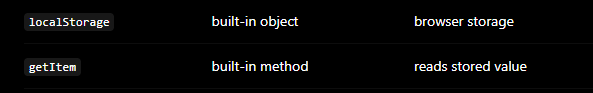

const [count, setCount] = useState`<number>`(() => {

    console.log("Inilializer running...")

    const saved = localStorage.getItem('count');

    return saved ? Number(saved) : 0;

});

##### useState(initializer)

The initializer runs only once so React can preserve state across re-renders instead of resetting it every time the component function executes.

##### const [count, setCount] = useState `<number>`(...)

* `useState<number>` → state type is `number`
* `count` → current value (user-defined variable)
* `setCount` → function to update it (user-defined name)

##### return saved ? Number(saved) : 0;

**structure:**

condition ? value_if_true : value_if_false

* If `saved` is NOT null → true
* If `saved` is null → false

### What is render?

> React calling your component function to figure out UI
>
> What is re-render?

> React calling the component again because state/props changed
>
> ### ❓ What runs again?
>
> | Part                          | Runs again? |
> | ----------------------------- | ----------- |
> | useState initializer          | ❌ No       |
> | component function            | ✅ Yes      |
> | console logs inside component | ✅ Yes      |

# What happens when the page refreshes?

When you refresh the page (F5 / reload):

## React does NOT remember anything

* All React state is wiped
* Component is destroyed
* Everything starts fresh

| Aspect                                  | Lazy Function Initializer                                          | Direct Value Initializer                                    |
| --------------------------------------- | ------------------------------------------------------------------ | ----------------------------------------------------------- |
| **Syntax**                        | `useState(() => initialValue)`                                   | `useState(initialValue)`                                  |
| **What you pass**                 | A function (React will call it)                                    | A value (already computed)                                  |
| **When it runs (first render)**   | React**calls the function once**to compute the initial state | Value is**used directly**                             |
| **When it runs (re-render)**      | ❌ Function is**NOT called again**                           | ❌ Value is**ignored after first render**             |
| **Computation timing**            | **Deferred (lazy)**→ runs only when needed (first render)   | **Immediate**→ evaluated before `useState`runs     |
| **Performance impact**            | Efficient for**expensive calculations**                      | Can be inefficient if calculation is heavy                  |
| **Example (simple)**              | `useState(() => 1)`                                              | `useState(1)`                                             |
| **Example (real use)**            | `useState(() => Number(localStorage.getItem('count'))              |                                                             |
| **If calculation is expensive**   | ✅ Runs once → good                                               | ❌ Runs on every render → wasteful                         |
| **Typical use case**              | Reading from `localStorage`, complex logic, API-derived defaults | Static defaults like `0`,`''`,`[]`                    |
| **Mental model**                  | “React, run this once to get the initial value”                  | “Here is the initial value”                               |
| **Behavior after initialization** | Stored in React state memory and reused                            | Same — stored and reused                                   |
| **Risk if misused**               | None (safe pattern)                                                | Can cause**performance issues**if heavy logic is used |
